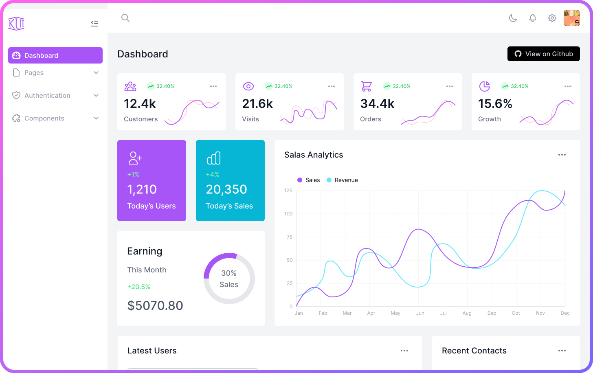
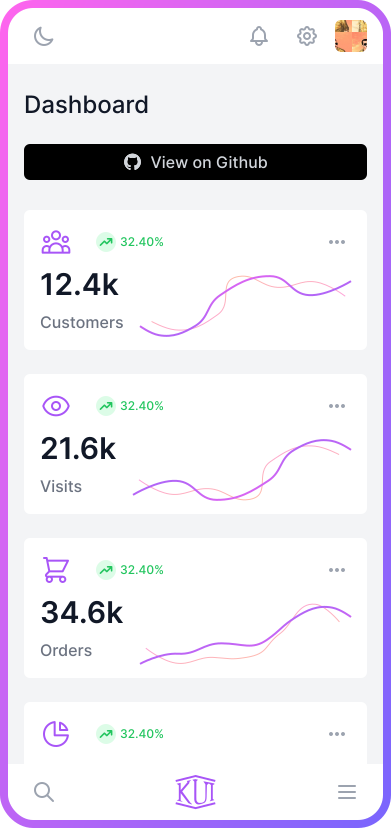
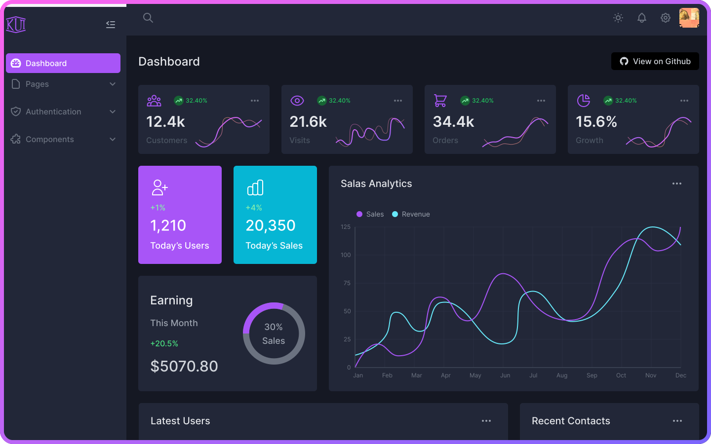
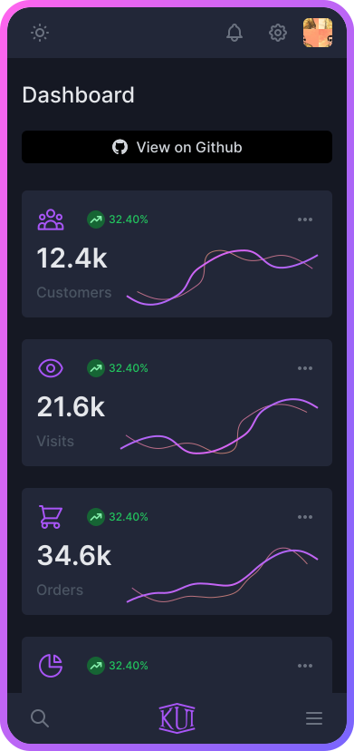

## K UI Admin Dashboard Template (Vue 3)

> ⚠️ This template is not finished yet.

### [Live preview](https://kamona-ui.github.io/kui-dashboard/)

##### [HTML version](https://github.com/kamona-ui/kui-dashboard/tree/main/templates/html#readme)

##### [Laravel package](https://github.com/Kamona-WD/kui-laravel-breeze/)

|                                                    |                                                  |
| -------------------------------------------------- | ------------------------------------------------ |
|  |  |
|    |    |

##### To get started:

```bash
# 1. Clone the repository:
git clone https://github.com/kamona-ui/kui-dashboard.git

cd kui-dashboard

# 2. Install the dependencies:
yarn install

# 3. Start the development server:
yarn dev:vue
```

##### Build

```bash
yarn build:vue

# Preview
yarn preview:vue
```

---

## Support

[](https://www.paypal.me/Akamel721/)
